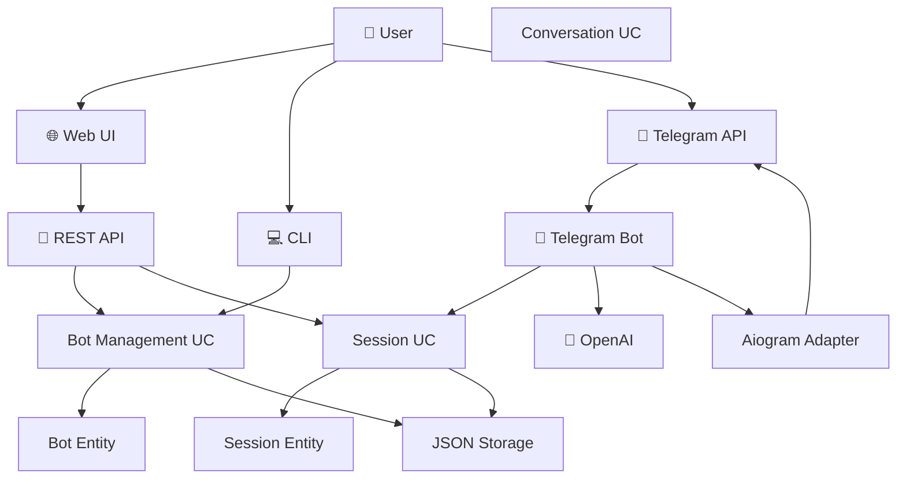

# 🔗 DEPENDENCY GRAPH - Граф зависимостей системы

**Цель:** Визуализация связей между модулями для понимания архитектуры

---

## 📊 HIGH-LEVEL OVERVIEW

```
┌─────────────────────────────────────────────────────┐
│                  EXTERNAL WORLD                      │
│  (Telegram API, OpenAI, User Browser, CLI, Файлы)   │
└───────────────────────┬─────────────────────────────┘
                        │
                        ▼
┌─────────────────────────────────────────────────────┐
│                    ADAPTERS                          │
│  (Реализации внешних интеграций)                    │
│  ┌──────────┐  ┌──────────┐  ┌──────────┐          │
│  │ Telegram │  │ Storage  │  │ Updater  │          │
│  │ (Aiogram)│  │  (JSON)  │  │  (Git)   │          │
│  └──────────┘  └──────────┘  └──────────┘          │
└───────────────────────┬─────────────────────────────┘
                        │ implements
                        ▼
┌─────────────────────────────────────────────────────┐
│                     PORTS                            │
│  (Интерфейсы / Protocols)                           │
│  ┌──────────────┐  ┌────────────┐  ┌──────────┐   │
│  │TelegramPort  │  │ StoragePort│  │UpdaterPort│   │
│  └──────────────┘  └────────────┘  └──────────┘   │
└───────────────────────┬─────────────────────────────┘
                        │ uses
                        ▼
┌─────────────────────────────────────────────────────┐
│                   USE CASES                          │
│  (Application Logic)                                 │
│  ┌─────────────┐  ┌──────────┐  ┌─────────────┐   │
│  │Bot Mgmt     │  │Conv Mgmt │  │Session Mgmt │   │
│  │System       │  │Link Trans│  │             │   │
│  └─────────────┘  └──────────┘  └─────────────┘   │
└───────────────────────┬─────────────────────────────┘
                        │ uses
                        ▼
┌─────────────────────────────────────────────────────┐
│                    DOMAIN                            │
│  (Business Entities - Core Logic)                    │
│  ┌──────┐  ┌────────┐  ┌────────────┐  ┌──────┐   │
│  │ Bot  │  │Config  │  │UserSession │  │ Conv │   │
│  └──────┘  └────────┘  └────────────┘  └──────┘   │
└─────────────────────────────────────────────────────┘

                ЗАВИСИМОСТИ ИДУТ ВНИЗ ↓
              (к чистой бизнес-логике)
```

---

## 🎯 DETAILED MODULE DEPENDENCIES

### 1. Entry Points → Use Cases

```
apps/api/app.py
    │
    ├─→ core/usecases/bot_management.py
    ├─→ core/usecases/conversation_management.py
    ├─→ core/usecases/system.py
    └─→ core/services/user_session_service.py

apps/cli/cli_app.py
    │
    ├─→ core/usecases/bot_management.py
    ├─→ core/usecases/conversation_management.py
    └─→ core/usecases/system.py

src/app.py (legacy)
    │
    ├─→ src/config_manager.py
    ├─→ src/bot_manager.py
    ├─→ src/telegram_bot.py
    └─→ src/admin_bot.py

src/telegram_bot.py
    │
    ├─→ openai (external)
    ├─→ aiogram (external)
    ├─→ src/config_manager.py
    └─→ core/services/user_session_service.py
```

---

### 2. Use Cases → Ports

```
core/usecases/bot_management.py
    │
    ├─→ core/ports/storage.py (ConfigStoragePort)
    └─→ core/domain/bot.py

core/usecases/conversation_management.py
    │
    ├─→ core/ports/storage.py (ConfigStoragePort)
    └─→ core/domain/conversation.py

core/usecases/user_session_management.py
    │
    ├─→ core/ports/storage.py (ConfigStoragePort)
    └─→ core/domain/user_session.py

core/usecases/system.py
    │
    ├─→ core/ports/updater.py (UpdaterPort)
    └─→ core/domain/config.py

core/usecases/link_transformation.py
    │
    └─→ core/domain/link_transformation.py
```

---

### 3. Adapters → Ports (Implementation)

```
adapters/storage/json_adapter.py
    │
    └─→ implements core/ports/storage.py
        (ConfigStoragePort protocol)

adapters/telegram/aiogram_adapter.py
    │
    └─→ implements core/ports/telegram.py
        (TelegramPort protocol)

adapters/updater/git_adapter.py
    │
    └─→ implements core/ports/updater.py
        (UpdaterPort protocol)
```

---

### 4. Services → Use Cases + Domain

```
core/services/user_session_service.py
    │
    ├─→ core/usecases/user_session_management.py
    ├─→ core/domain/user_session.py
    └─→ aiogram (для отправки сообщений)
```

---

## 🔄 DATA FLOW EXAMPLES

### Example 1: Создание бота

```
User clicks "Create Bot" in Web UI
    ↓
POST /api/v2/bots
    ↓
src/api/v2/bots.py:create_bot_v2()
    ↓
config_manager.add_bot_config()
    ↓
adapters/storage/json_adapter.py:write_config()
    ↓
bot_configs.json file updated
    ↓
Response sent to user
```

**Dependencies:**
```
src/api/v2/bots.py
    → src/config_manager.py
        → adapters/storage/json_adapter.py (indirectly)
            → bot_configs.json
```

---

### Example 2: User Session Flow

```
User A: /connect command
    ↓
Telegram API → Aiogram
    ↓
src/telegram_bot.py:cmd_connect()
    ↓
core/services/user_session_service.py:handle_connect_command()
    ↓
core/usecases/user_session_management.py:get_online_users()
    ↓
adapters/storage/json_adapter.py:get_online_users_for_bot()
    ↓
bot_configs.json read
    ↓
List sent to User A

User A: Selects User B
    ↓
src/telegram_bot.py:handle_callback_query()
    ↓
core/services/user_session_service.py:handle_user_selection()
    ↓
core/usecases/user_session_management.py:create_session()
    ↓
core/domain/user_session.py:UserSession entity created
    ↓
adapters/storage/json_adapter.py:set_user_session()
    ↓
bot_configs.json updated
    ↓
Notification sent to User B

User B: Accepts
    ↓
Similar flow → session.accept()
    ↓
Session becomes ACTIVE

Message from User A
    ↓
src/telegram_bot.py:handle_message()
    ↓
core/services/user_session_service.py:route_session_message()
    ↓
core/usecases/user_session_management.py:get_active_session()
    ↓
Message forwarded to User B via Telegram API
```

**Dependencies:**
```
src/telegram_bot.py
    → core/services/user_session_service.py
        → core/usecases/user_session_management.py
            → core/domain/user_session.py
            → adapters/storage/json_adapter.py
                → bot_configs.json
```

---

### Example 3: OpenAI Integration

```
User sends message to bot
    ↓
Telegram API → Aiogram
    ↓
src/telegram_bot.py:handle_message()
    ↓
Check if message is voice
    ├─→ YES: OpenAI Whisper transcription
    └─→ NO: Continue
    ↓
Get conversation history
    ↓
src/config_manager.py:get_conversation_cache()
    ↓
OpenAI Assistant API call
    ↓
client.beta.threads.messages.create()
client.beta.threads.runs.create()
client.beta.threads.runs.retrieve()
    ↓
Get response from assistant
    ↓
Check if voice response needed
    ├─→ YES: OpenAI TTS
    └─→ NO: Continue
    ↓
Save conversation
    ↓
src/config_manager.py:set_conversation_cache()
    ↓
Send response to user via Telegram
```

**Dependencies:**
```
src/telegram_bot.py
    → openai.OpenAI (external)
    → aiogram.Bot (external)
    → src/config_manager.py
        → adapters/storage/json_adapter.py
            → bot_configs.json
```

---

## 🏗️ LAYERED ARCHITECTURE

```
┌────────────────────────────────────────────┐
│         PRESENTATION LAYER                 │
│  (Web UI, CLI, REST API, Telegram Bot)     │
└──────────────────┬─────────────────────────┘
                   │
┌──────────────────▼─────────────────────────┐
│         APPLICATION LAYER                  │
│  (Use Cases, Services, Business Logic)     │
└──────────────────┬─────────────────────────┘
                   │
┌──────────────────▼─────────────────────────┐
│            DOMAIN LAYER                    │
│  (Entities, Value Objects, Business Rules) │
└──────────────────┬─────────────────────────┘
                   │
┌──────────────────▼─────────────────────────┐
│       INFRASTRUCTURE LAYER                 │
│  (Adapters, External APIs, File System)    │
└────────────────────────────────────────────┘
```

**Правило:** Каждый слой зависит только от слоев ниже.

---

## 🔒 DEPENDENCY RULES

### ✅ ALLOWED (Правильные зависимости)

```python
# Entry point → Use Case
from core.usecases.bot_management import BotManagementUseCase

# Use Case → Port (interface)
from core.ports.storage import ConfigStoragePort

# Use Case → Domain
from core.domain.bot import Bot

# Adapter → Port (implements)
from core.ports.storage import ConfigStoragePort

# Entry point → Adapter (для DI)
from adapters.storage.json_adapter import JsonConfigStorageAdapter
```

### ❌ FORBIDDEN (Неправильные зависимости)

```python
# Domain → Use Case (NEVER!)
from core.usecases.bot_management import ...

# Domain → Port (NEVER!)
from core.ports.storage import ...

# Domain → Adapter (NEVER!)
from adapters.storage.json_adapter import ...

# Use Case → Adapter directly (Use Port instead!)
from adapters.storage.json_adapter import ...

# Domain → External library (minimal, only stdlib)
import requests  # ❌ Not in domain!
```

---

## 📦 PACKAGE DEPENDENCIES

### External Dependencies

```
core/
    ├─→ NO external dependencies (только stdlib)
    └─→ typing, dataclasses, abc, datetime

adapters/
    ├─→ aiogram (Telegram)
    ├─→ openai (only in telegram_bot.py)
    └─→ gitpython (for updater)

src/ (legacy)
    ├─→ flask
    ├─→ aiogram
    ├─→ openai
    ├─→ psutil
    └─→ многие другие...

apps/
    ├─→ flask (для API/Web)
    ├─→ click (для CLI)
    └─→ core/usecases (internal)

tests/
    ├─→ pytest
    ├─→ pytest-asyncio
    ├─→ pytest-cov
    └─→ all project modules
```

---

## 🔄 CIRCULAR DEPENDENCIES (Избегать!)

### ⚠️ Potential Issues

```python
# ПЛОХО: Circular import
# file: bot_manager.py
from telegram_bot import send_notification

# file: telegram_bot.py
from bot_manager import get_bot_status
# ❌ Circular dependency!
```

### ✅ Solutions

**1. Dependency Injection:**
```python
class TelegramBot:
    def __init__(self, bot_manager: BotManager):
        self.bot_manager = bot_manager
```

**2. Interface/Port:**
```python
# core/ports/telegram.py
class TelegramPort(Protocol):
    def send_message(...): ...

# bot_manager.py uses TelegramPort
# telegram_bot.py implements TelegramPort
```

**3. Event System:**
```python
# Emit events instead of direct calls
event_bus.emit('bot_status_changed', bot_id)
```

---

## 🎨 VISUALIZATION WITH MERMAID



---

## 📊 DEPENDENCY METRICS

```
Coupling Metrics:
├── core/domain/          - 0 external deps ✅
├── core/usecases/        - 0 external deps ✅
├── core/services/        - 1 external dep (aiogram) ⚠️
├── adapters/             - Multiple (expected) ✅
└── src/ (legacy)         - Many (needs refactor) ⚠️

Cohesion:
├── core/domain/          - High ✅
├── core/usecases/        - High ✅
├── adapters/             - High ✅
└── src/ (legacy)         - Medium ⚠️
```

---

## 🚨 ANTI-PATTERNS TO AVOID

### 1. God Object
```python
# ❌ ПЛОХО: Один класс делает все
class BotManager:
    def create_bot(...): ...
    def send_message(...): ...
    def process_payment(...): ...
    def generate_report(...): ...
    # Слишком много ответственностей!
```

### 2. Tight Coupling
```python
# ❌ ПЛОХО: Прямая зависимость от implementation
class BotUseCase:
    def __init__(self):
        self.storage = JsonConfigStorageAdapter()  # ❌
```

```python
# ✅ ХОРОШО: Зависимость от interface
class BotUseCase:
    def __init__(self, storage: ConfigStoragePort):
        self.storage = storage  # ✅
```

### 3. Leaky Abstractions
```python
# ❌ ПЛОХО: Use case знает о JSON
def save_bot(bot: Bot):
    with open('config.json', 'w') as f:
        json.dump(bot.dict(), f)  # ❌ I/O в use case!
```

```python
# ✅ ХОРОШО: Use case делегирует storage
def save_bot(bot: Bot):
    self.storage.save_bot(bot)  # ✅ Abstraction
```

---

## ✅ BEST PRACTICES

1. **Dependency Direction:** Always point inward (to domain)
2. **Interface Segregation:** Small, focused interfaces
3. **Dependency Injection:** Inject dependencies via constructor
4. **Immutable Domain:** Domain entities should be immutable
5. **No Business Logic in Adapters:** Adapters are thin wrappers

---

**Создан:** AI Assistant  
**Дата:** 15 октября 2025  
**Версия:** 1.0

